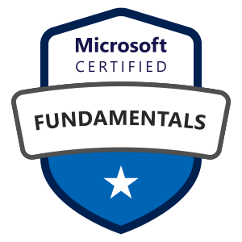
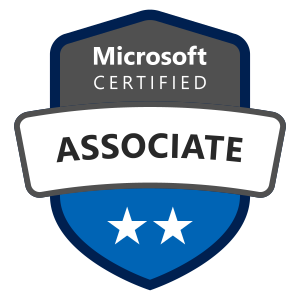
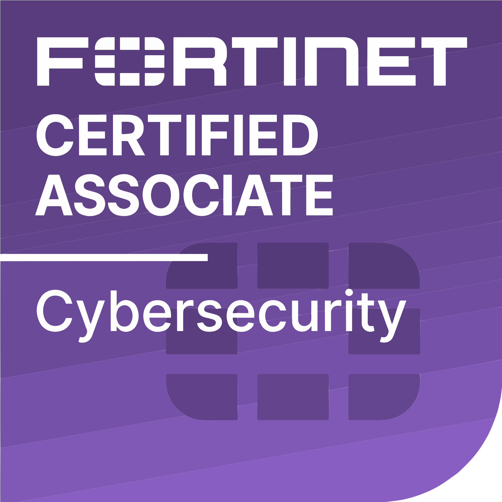
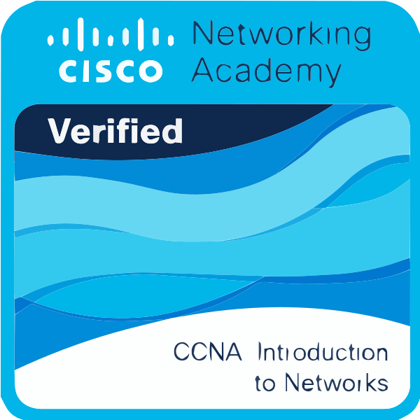

<h1 align="center">Hi, I'm <a href="https://www.linkedin.com/in/mikkel-damgaard/">Mikkel</a> ☁️</h1>

  

  
  
  

  
  
  
  

<table align="center" border="0" cellpadding="0" cellspacing="0">
  <tr>
    <td align="center" valign="top" cellpadding="0" cellspacing="0">
       
      <b>AZ-900</b> 
      Azure Fundamentals
    </td>
    <td align="center" valign="top">
       
      <b>MS-900</b> 
      Microsoft 365 Fundamentals
    </td>
    <td align="center" valign="top">
       
      <b>SC-900</b> 
      Security, Compliance & Identity
    </td>
    <td align="center" valign="top">
       
      <b>MD-102</b> 
      Endpoint Admin
    </td>
    <td align="center" valign="top">
       
      <b>SC-300</b> 
      Identity & Access
    </td>
    <td align="center" valign="top">
       
      <b>FCA</b> 
      Fortinet Assoc.
    </td>
    <td align="center" valign="top">
       
      <b>CCNA</b> 
      Cisco Network Assoc.
    </td>
  </tr>
</table>

---

### <strong>About me</strong>

I’m **Mikkel Damgaard**, a **Junior Cloud Infrastructure Consultant** from Denmark, based near Herning.

My day-to-day work is centered around **Microsoft Cloud**, especially **Intune**, **Entra**, and practical endpoint management. Outside of work, I spend a lot of time in my **Linux homelab**, where I build and test infrastructure with **Proxmox** and **Docker**.

I’m also working toward becoming a **Microsoft Student Ambassador**, while contributing to the **Microsoft Intune / Entra advisors’ community** through knowledge sharing and real-world feedback.

Outside of tech, I’m into **sports, woodworking, and cooking**.

---

### <strong>Core areas</strong>

**Microsoft:** Intune, Entra ID, Microsoft 365  
**Infrastructure:** Endpoint management, lifecycle, automation  
**Homelab:** Proxmox, Docker, Linux, self-hosted services  
**Other:** PowerShell, networking, security fundamentals

---

### <strong>Featured links</strong>

- **[My website](https://mikkeldamgaard.dk)** — blog posts, technical notes, and personal projects
- **[Modern deployment with Autopilot](https://mikkeldamgaard.dk/knowledge-base/microsoft-intune/part-1-modern-deployent-autopilot-enrollment-and-configuration)** — Intune / Autopilot walkthrough
- **[Homelab](https://mikkeldamgaard.dk/home-server)** — infrastructure, services, and self-hosting
