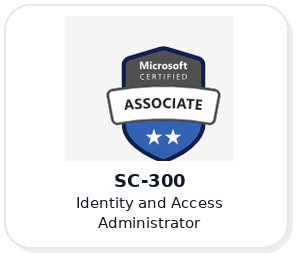
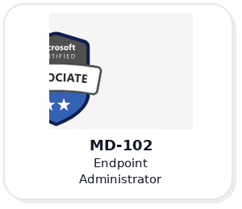
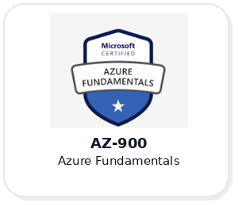
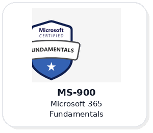
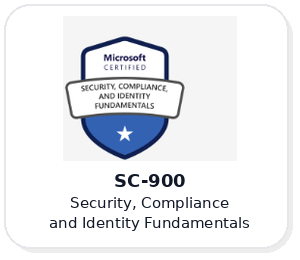
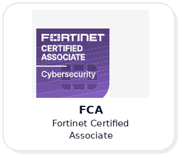
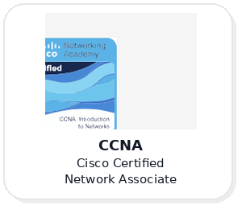

<div align="center">

# Mikkel Damgaard

**Junior Cloud Infrastructure Consultant**  
*Microsoft Cloud · Intune · Entra · Linux Homelab*

<a href="https://mikkeldamgaard.dk">Website</a> ·
<a href="https://www.linkedin.com/in/mikkel-damgaard/">LinkedIn</a> ·
<a href="https://learn.microsoft.com/en-us/users/mikkeldamgrd-9811/?WT.mc_id=studentamb_510215">Microsoft Learn</a> ·
<a href="mailto:mld.damgaard@gmail.com">Email</a>

</div>

---

## About

I'm Mikkel, a 21-year-old infrastructure-focused IT professional from Denmark, based near Herning.

I work primarily with **Microsoft Cloud** technologies and endpoint management, and I spend a lot of my free time building, testing, and improving services in my own **Linux-based homelab**.

I’m currently working toward becoming a **Microsoft Student Ambassador**, where I focus on sharing knowledge through blog posts and community engagement. I’m also part of the **Microsoft Intune / Entra advisors’ community**, with a goal of helping strengthen the Microsoft platform through practical feedback and real-world experience.

Outside of IT, I’m into **sports, woodworking, and cooking**.

---

## Focus areas

- **Microsoft Intune**
- **Microsoft Entra ID**
- **Microsoft 365**
- **Endpoint management & automation**
- **Linux systems**
- **Proxmox virtualization**
- **Docker-based services**

---

## Projects & writing

### Modern deployment with Autopilot
A practical Microsoft Intune guide focused on enrollment and configuration.

**Read more:**  
<https://mikkeldamgaard.dk/knowledge-base/microsoft-intune/part-1-modern-deployent-autopilot-enrollment-and-configuration>

### Homelab
My personal lab where I work with infrastructure, virtualization, self-hosting, and platform testing.

**Read more:**  
<https://mikkeldamgaard.dk/home-server>

---

## Certifications

<div align="center">
  
  
  
</div>

<div align="center">
  
  
  
  
</div>

---

## Tech

```text
Microsoft Intune   Microsoft Entra ID   Microsoft 365
Proxmox            Docker                Linux
PowerShell         Endpoint Management   Infrastructure
```

---

## Current direction

- Building and refining my homelab platform
- Sharing Microsoft-focused content on my website
- Growing deeper in Intune, Entra, and practical cloud infrastructure
